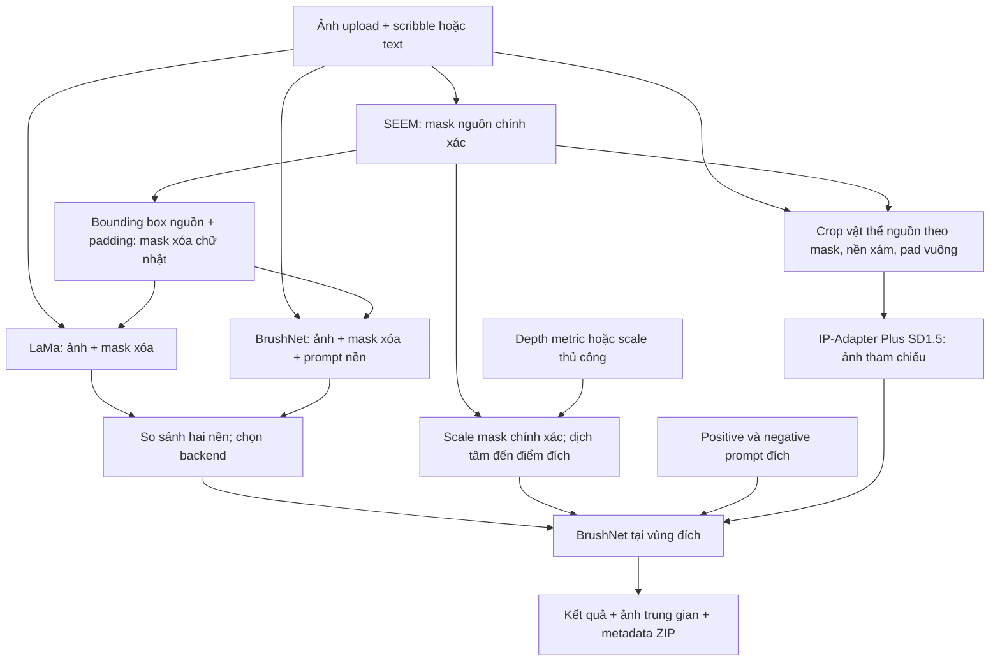

# Flow relocation và hướng dẫn chạy RunPod

## 1. Mục tiêu

Upload ảnh, chọn vật thể bằng scribble hoặc text, xóa vật thể nguồn, đặt một
mask đích đã scale tại điểm người dùng chọn và sinh vật thể trong vùng đó.
Có hai backend xóa nguồn: **LaMa** và **BrushNet**, để so sánh trực quan.

Điểm đích là **tâm mask vật thể**, không phải chân hoặc điểm tiếp xúc mặt đất.
Hướng vật thể không được xoay bằng phép biến đổi hình học.

## 2. Flow



Các GPU task chạy lần lượt. Sau SEEM, model và cache language embedding được
chuyển về CPU. Mỗi worker LaMa/Depth/BrushNet kết thúc trước bước tiếp theo.
Khi chọn BrushNet cho cả xóa và sinh đích, hai worker riêng được chạy tuần tự;
không giữ hai pipeline BrushNet đồng thời trong VRAM, nhưng phải nạp lại model.

## 3. Phân biệt các mask

| Mask | Cách tạo | Vai trò |
|---|---|---|
| source_mask.png | SEEM hoặc mask upload đã sửa | Hình dáng nguồn chính xác |
| removal_mask.png | Chữ nhật bao tất cả pixel nguồn, nới padding và giới hạn theo biên ảnh | Xóa nguồn; không truyền hình đầu/thân/chân |
| target_mask.png | Scale mask nguồn quanh tâm, dịch đến tâm đích | Hình dáng và vị trí đích |
| generation_mask.png | Toàn bộ mask đích nới nhẹ trong generate, hoặc vòng viền trong preserve | Pixel BrushNet được phép sửa tại đích |

**Padding xóa không phải chỉ dilation silhouette.** Chỉ nới silhouette vài pixel
vẫn giữ hình con vật. Ở bản này, mọi pixel bên trong bounding box đều là trắng,
kể cả khoảng trống giữa chân, rồi mới thêm padding. Mask chính xác ban đầu
không bị sửa; nó tiếp tục được dùng cho target.

Đổi lại, hình chữ nhật xóa nhiều nền hơn mask chính xác. Padding quá lớn làm mất
ngữ cảnh và có thể giảm chất lượng. Bắt đầu với **8 px** ở kích thước ảnh làm việc.
BrushNet vẫn có thể sinh vật thể ngoài ý muốn; đổi mask không phải bảo đảm xóa.

## 4. Hai backend xóa nguồn

### LaMa

* Big-LaMa TorchScript, môi trường .venv-lama riêng.
* Nhận ảnh + mask xóa, không dùng text prompt.
* Chỉ ghép output trong vùng xóa, giữ nguyên bên ngoài.

### BrushNet

* Dùng pipeline SD 1.5; lượt xóa dùng **BrushNetX** chính thức từ TencentARC/BrushEdit.
* Mask xóa là hình chữ nhật giống LaMa; RGB vùng đó được đặt về đen khi inference.
* Positive prompt chỉ mô tả nền cần nối lại.
* Negative prompt xóa độc lập với negative prompt đích.
* Lượt đích giữ `segmentation_mask_brushnet_ckpt`. Hai checkpoint có đường dẫn riêng;
  `--removal-brushnet-checkpoint` cho phép đối chiếu với checkpoint cũ.
* BrushNetX có cấu hình BrushNetModel / cross-attention 768 tương thích pipeline
  SD1.5 hiện tại. Đây vẫn là mô hình sinh ảnh, không bảo đảm chỉ tạo background.

Ví dụ cho ảnh con cừu trên cỏ:

```text
Positive prompt nền:
A continuous green lawn, dense grass matching the surrounding texture, lighting and perspective.

Negative prompt XÓA:
animal, sheep, dog, tiger, person, body, head, legs, fur, wall, concrete, building, panel, frame, cage, basket, artifacts
```

Không dùng câu mô tả kết quả mong muốn làm negative prompt.
Trong UI chọn preset **Cỏ / bãi cỏ** cho ảnh ví dụ. Prompt nền chung chung có thể
khiến diffusion tạo tường hoặc vật thể mới dù mask đã là chữ nhật. Preset này
không phù hợp với ảnh có nền bê tông thật; sửa prompt theo cảnh đang dùng.

## 5. Tại vị trí đích

### generate — mặc định

BrushNet nhận nền đã xóa + toàn bộ mask đích nới nhẹ + text. Nó sinh lại vật thể
trong vùng đó. **IP-Adapter Plus SD1.5** mặc định bật trong UI: crop RGB vật thể
nguồn theo mask, thay nền bằng xám và pad vuông để CLIP không cắt mất tai/chân.
Ảnh này được truyền riêng qua `ip_adapter_image`, không dán vào input generate.
Strength bắt đầu **0.6**, thử 0.4–0.8; quá cao có thể giảm khả năng hòa nhập cảnh.
Tắt checkbox để đối chiếu cùng seed. IP-Adapter chỉ dùng tại đích, không dùng
khi xóa vì ảnh tham chiếu sẽ khuyến khích tái tạo vật thể cần loại bỏ.
Mask quy định vùng sửa; chưa bắt buộc đúng silhouette và nhận dạng vật thể nguồn.

```text
Positive prompt ĐÍCH:
A sheep standing naturally on green grass.

Negative prompt ĐÍCH:
frame, basket, cage, rope, duplicate objects, artifacts, distorted shapes
```

Nếu để trống positive đích, code lấy mô tả vật thể và thêm câu về lighting/texture.
Nút xem prompt thực tế hiển thị positive/negative nguồn và đích tương ứng.

### preserve — để đối chiếu

Scale và dán RGB + alpha nguồn lên nền sạch, sau đó BrushNet sửa một vòng viền.
Giữ phần lõi; vòng viền vẫn có thể sinh nội dung sai. Padding đích mặc định 3 px.
Ảnh pasted.png là mốc cắt–dán, không phải input tham chiếu cho generate.

## 6. Chọn RunPod

* Khởi đầu: 1 GPU **RTX 2000 Ada 16 GB** hoặc A5000 24 GB; inference 512.
* Host RAM ít nhất 32 GB, ưu tiên nhiều hơn nếu có vì CPU offload.
* Template phù hợp: Ubuntu 22.04, Python 3.10, CUDA 12.1 bản devel để build SEEM.
* HTTP ports: **7860** (Gradio), 8888 nếu cần Jupyter; TCP 22 nếu dùng SSH.
* Dùng persistent storage tại /workspace cho code, venv, cache và checkpoint.

16 GB cần xác nhận bằng inference thực tế. Đây không phải cam kết đủ ở mọi
kích thước ảnh. Theo dõi nvidia-smi cùng số đo peak trong JSON từng worker.

## 7. Pod đã chạy được phiên bản có LaMa

Dừng demo cũ bằng Ctrl+C. Kích hoạt đúng môi trường đã chạy demo_v1.py.

```bash
cd /workspace/Segment-Everything-Everywhere-All-At-Once
git fetch origin
git checkout exp_v1
git pull --ff-only origin exp_v1

export BRUSHNET_REPO=/workspace/BrushNet
export HF_HOME=/workspace/hf-cache
export RELOCATION_OUTPUT_DIR=/workspace/relocation_outputs

python3 demo_relocation.py --preflight
python3 demo_relocation.py --server-name 0.0.0.0 --port 7860 --max-side 512
```

Không cần cài lại dependencies cho lựa chọn BrushNet xóa nguồn mới.

Nếu chưa cài LaMa ở lần cập nhật trước, chạy thêm trước preflight:

```bash
bash setup_relocation.sh --only-lama
```

## 8. Pod mới

```bash
cd /workspace
git clone --branch exp_v1 https://github.com/KhoaLeDang2375/Segment-Everything-Everywhere-All-At-Once.git
git clone https://github.com/TencentARC/BrushNet.git
cd Segment-Everything-Everywhere-All-At-Once

export BRUSHNET_REPO=/workspace/BrushNet
export HF_HOME=/workspace/hf-cache
export RELOCATION_OUTPUT_DIR=/workspace/relocation_outputs

python3 --version
nvidia-smi
python3 -m pip install 'numpy<2' 'setuptools<70'
python3 -m pip install torch==2.1.2 torchvision==0.16.2 --index-url https://download.pytorch.org/whl/cu121
bash setup_relocation.sh

python3 demo_relocation.py --preflight
python3 demo_relocation.py --server-name 0.0.0.0 --port 7860 --max-side 512
```

Nếu SEEM đã được setup và chạy được nhưng chưa có worker mới, dùng
bash setup_relocation.sh --skip-seem thay cho setup đầy đủ.

Mở RunPod → Connect → HTTP service 7860. Ctrl+Shift+R sau khi cập nhật code.
Giữ Gradio 3.50.2; notice nâng cấp hoặc gợi ý share=True không phải lỗi.

## 9. Quy trình so sánh trên giao diện

1. Upload ảnh, scribble trong vật thể; nhập mô tả rồi lấy mask.
2. Kiểm tra mask nguồn, upload mask sửa nếu cần.
3. Chọn padding chữ nhật và xem mask xóa.
4. Nhập prompt nền/negative xóa. Nút **So sánh LaMa và BrushNet cạnh nhau** chạy
   cả hai tuần tự trên cùng ảnh và mask, hiển thị hai kết quả.
5. Chọn backend dùng cho đích. Bấm nút xóa backend đã chọn để cập nhật preview;
   khi chạy cuối, code luôn kiểm tra cache theo backend và tham số hiện tại.
6. Chọn tâm đích, chọn Indoor/Outdoor depth đúng cảnh hoặc chỉnh scale thủ công.
   Nếu vật thể vượt biên, preview vẫn hiển thị phần bị cắt và hướng dẫn ở ô trạng
   thái. Bấm **Thu nhỏ để vừa ảnh** để giảm scale, giữ nguyên tâm đã chọn; hoặc
   bật cho phép cắt biên. Chạy thật vẫn yêu cầu một trong hai lựa chọn này.
   Tâm sát biên đến mức scale 0.2 không vừa thì phải đổi tâm hoặc chấp nhận cắt.
7. Giữ cùng scale, tâm đích, prompt đích, seed và tham số khi so sánh kết quả cuối.
8. Chạy generate hoặc preserve; tải ZIP mỗi lần để lưu thí nghiệm.

LaMa và BrushNet có quy tắc resize nội bộ khác nhau để tương thích từng model;
không coi đây là benchmark chất lượng có kiểm soát tuyệt đối. Metadata lưu
inference_size, prompts, seed, checkpoint, thời gian và peak VRAM.
Cache LaMa bỏ qua text vì model không dùng text. Cache BrushNet có prompt,
negative, seed, steps, guidance, conditioning, padding và checkpoint.

## 10. Đọc output và xử lý lỗi

* background.png: đánh giá việc xóa nguồn trước tiên.
* removal_raw.png: raw output; chỉ vùng removal_mask được ghép lại.
* target_mask.png: xem scale/tâm; generation_mask.png: vùng sửa tại đích.
* pasted.png: so sánh hình học với vật thể nguồn.
* harmonization_raw.png và result.png: output đích raw và kết quả đã giới hạn vùng.
* removal_result.json: backend xóa, mask shape, checkpoint và số đo.
* removal_brushnet_request/result.json hoặc removal_lama_request/result.json:
  provenance lượt xóa, được đổi tiền tố để không bị worker đích ghi đè.
* brushnet_request/result.json: lượt tại đích; metadata.json tổng hợp thí nghiệm.

GPU workers dùng môi trường riêng. Logs nằm trong thư mục job trên Pod, không
đưa vào ZIP. Preflight chỉ kiểm tra imports/path/CUDA, không xác nhận chất lượng.

Hai lỗi Gradio đã sửa: mask=None trước nét vẽ được chuyển thành mask rỗng trước
preprocess; negative canvas không có nét vẽ bị bỏ qua, nét vẽ thật được kiểm tra
kích thước/nội dung ảnh với dung sai nhỏ. Negative canvas của ảnh khác vẫn bị từ chối.

## 11. Giới hạn

Depth tại tâm đích lấy từ nền nhìn thấy; không chắc bằng depth tâm vật thể tương
lai. Scale tự động là đề xuất. Mask đích không chứa RGB/identity. Pipeline chưa
giải quyết đầy đủ bóng, occlusion, điểm tiếp xúc, orientation 3D hoặc identity
khi generate. Nên xác nhận nền sạch rồi mới đánh giá bước sinh đích.

Tham khảo code chi tiết và dependency isolation: [RELOCATION.md](RELOCATION.md).
Kế hoạch revision: [RELOCATION_PLAN.md](RELOCATION_PLAN.md).


## 10. Cập nhật BrushNetX + IP-Adapter trên pod đang chạy

Dừng Gradio bằng Ctrl+C. Dùng môi trường Python 3.10 đã chạy SEEM:

```bash
cd /workspace/Segment-Everything-Everywhere-All-At-Once
git pull --ff-only origin exp_v1
bash setup_relocation.sh --only-brushnet
python demo_relocation.py --preflight
python demo_relocation.py --port 7860
```

Nếu tạo pod từ đầu, làm các bước cài ở mục 7 rồi chạy setup đầy đủ như trước;
setup đầy đủ hiện tải thêm BrushNetX và IP-Adapter. `--only-brushnet` chỉ cài
worker BrushNet và tải các model của nó, không cài SEEM/LaMa/depth.

Checkpoint nguồn: `checkpoints/brushnet/brushnetX` (TencentARC/BrushEdit,
revision `0d6ac4a`). Checkpoint đích: segmentation SD1.5 đang dùng.
IP-Adapter: `checkpoints/ip-adapter/models/ip-adapter-plus_sd15.safetensors`
và CLIP ViT-H trong `models/image_encoder` (h94/IP-Adapter, revision `018e402774aeeddd60609b4ecdb7e298259dc729`).
Tải một bản encoder safetensors, không tải thêm bản `.bin` trùng nội dung.
Dung lượng tải thêm khoảng 5.1 GB; đây là dung lượng đĩa, không phải VRAM.
Nguồn chính thức: [BrushNetX](https://huggingface.co/TencentARC/BrushEdit/tree/main/brushnetX)
và [IP-Adapter](https://huggingface.co/h94/IP-Adapter/tree/main/models).

Đối chiếu checkpoint xóa cũ nếu cần:

```bash
python demo_relocation.py --port 7860 \
  --removal-brushnet-checkpoint checkpoints/brushnet/segmentation_mask_brushnet_ckpt
```

Đổi đường dẫn qua `REMOVAL_BRUSHNET_CHECKPOINT`, `IP_ADAPTER_DIR`, hoặc
CLI `--removal-brushnet-checkpoint`, `--ip-adapter-dir`. Setup đặt BrushNetX
trong `BRUSHNET_MODEL_DIR/brushnetX`; nếu override đường dẫn removal riêng,
bạn cần trỏ tới thư mục model đã tải hoặc tự đặt model ở đó.

### VRAM và cách so sánh

Code lazy-load SEEM, chuyển SEEM/embedding về CPU sau segmentation;
BrushNet chạy FP16, mặc định `cuda` giữ toàn bộ pipeline trên GPU trong mỗi
lượt. `--brushnet-device cpu-offload` bật lại CPU offload. Các worker vẫn chạy
tuần tự rồi thoát.
Quan sát dưới 5 GB phù hợp chiến lược này, nhưng đọc `nvidia-smi` sau khi
worker thoát có thể bỏ qua peak. IP-Adapter thêm encoder ảnh FP16 và attention
vào UNet; encoder nằm trên GPU trong chế độ cuda, hoặc tham gia chuỗi CPU
offload trước UNet khi chọn cpu-offload. Không cộng tất cả
checkpoint như thể chúng cùng nằm trên GPU. 16 GB là cấu hình hợp lý để bắt đầu
ở 512, cần đo lại peak khi bật adapter; chưa có chạy GPU xác nhận bản cập nhật.
Giữ RAM host ít nhất 32 GB vì SEEM và các trọng số offload vẫn nằm trên CPU.

1. Chọn preset **Cỏ / bãi cỏ**, padding 8; so sánh LaMa và BrushNetX.
2. Chỉ tiếp tục khi nền sau xóa chấp nhận được; LaMa vẫn mặc định cho xóa.
3. Chế độ generate, bật IP-Adapter, strength 0.6, margin đích 3.
4. So sánh tắt/bật adapter với cùng seed, mask, prompt và scale.
5. Kiểm tra `ip_adapter_reference.png`, `removal_result.json`,
   `brushnet_result.json` và `metadata.json` trong ZIP. Peak worker là số đo
   tiến trình đó, không tính CUDA của tiến trình khác.

IP-Adapter hỗ trợ diện mạo; không bảo đảm bản sao vật thể hoặc silhouette chính
xác. Output được ghép theo vùng sửa nên vùng ngoài mask giữ nguyên, nhưng vật
thể sinh lớn hơn mask có thể bị cắt. Khi đó giảm strength/guidance hoặc tăng
margin đích nhẹ; preserve giữ RGB lõi nếu cần độ trung thành cao.


## 11. RTX 4000 Ada 20 GB: chạy toàn bộ pipeline trên GPU

Dừng Gradio, cập nhật code và chạy bằng Python SEEM hiện có. Nếu đã tải
BrushNetX/IP-Adapter ở mục 10 thì không cần cài hoặc tải model lại:

```bash
cd /workspace/Segment-Everything-Everywhere-All-At-Once
git pull --ff-only origin exp_v1
python demo_relocation.py --brushnet-device cuda --max-side 512 --port 7860
```

`cuda` là mặc định mới, có thể đặt `BRUSHNET_DEVICE=cuda`. Sau khi nạp FP16,
code gọi `pipe.to('cuda')`: UNet, BrushNet, VAE, text encoder, CLIP image encoder
và IP-Adapter ở trên GPU trong suốt inference. Không bật hook CPU offload.
LaMa/depth vốn đã chạy CUDA. SEEM vẫn chuyển về CPU sau segmentation để dành
bộ nhớ cho diffusion; không giữ mọi model cùng lúc trên GPU.

Mục đích là giảm truyền CPU–GPU khi diffusion chạy. Worker vẫn thoát sau mỗi
request, do đó lượt sau vẫn nạp lại model; chưa có cache pipeline thường trú.
Nền sau xóa có cache theo thông số, nên có thể bỏ qua lượt xóa khi so sánh đích.
VAE slicing được giữ; với batch một ảnh không cần bật thêm attention slicing
vì nó có thể giảm tốc. Không thay scheduler, số bước hay precision để tăng tốc.

Bắt đầu ở 512 trên 20 GB, sau đó có thể thử `--max-side 768` nếu peak đủ thấp.
Tăng resolution làm tăng chi phí và có thể OOM; chưa đo GPU bản cuda mới.
Trong JSON mỗi worker xem `brushnet_device`, `load_seconds`, `inference_seconds`,
`seconds`, `peak_allocated_gib` và `peak_reserved_gib`. Peak PyTorch thuộc worker
đó; tổng GPU còn bao gồm driver/CUDA và tiến trình khác. So sánh thời gian với
cùng seed, mask, prompt, resolution và steps; chưa có số liệu tăng tốc thực tế.

Nếu hết VRAM, dừng và khởi động lại với:

```bash
python demo_relocation.py --brushnet-device cpu-offload --max-side 512 --port 7860
```

Code báo gợi ý này khi worker BrushNet OOM, không tự đổi chế độ âm thầm.
